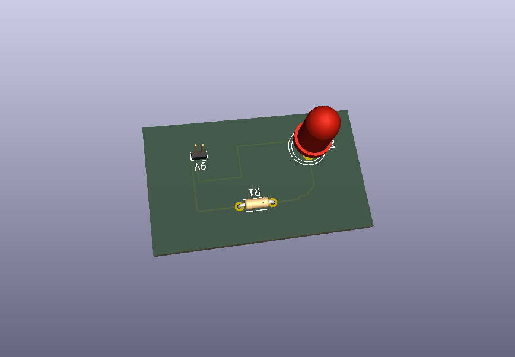
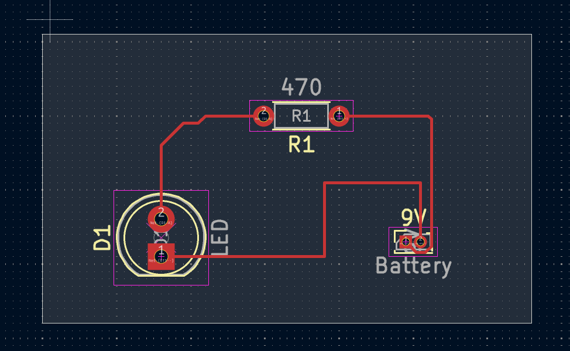

### LED PCB 만들어보기

[English](README.md)

이 프로젝트는 KiCad를 활용하여 PCB를 설계해보는 프로젝트입니다.  
목표로 하는 바가 있어서, PCB를 직접 공부해봤는데 좋은 기회가 된 것 같습니다.  
이제 시작이니 앞으로도 열심히 공부해봐야겠네요   

 

### 구성도 (PCB Design)

PIN_Header : Connector_PinHeader_1.00mm:PinHeader_2x01_P1.00mm_Vertical  
LED : LED_THT:LED_D5.0mm  
Resistor : Resistor_THT:R_Axial_DIN0204_L3.6mm_D1.6mm_P5.08mm_Horizontal  

